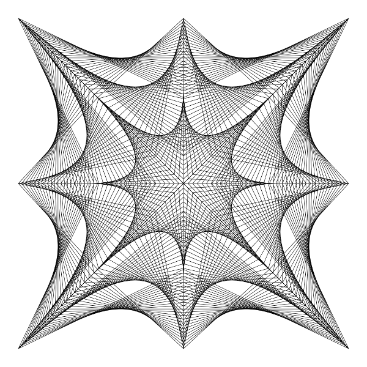
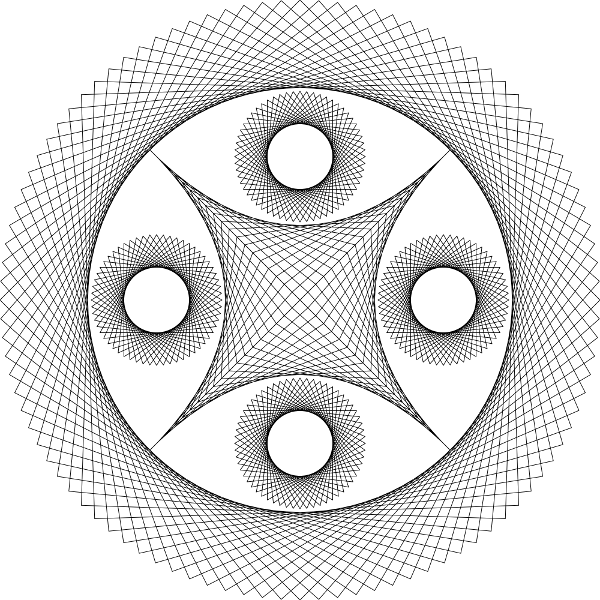
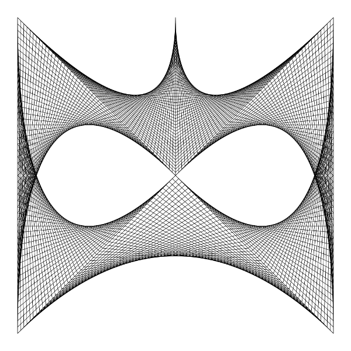
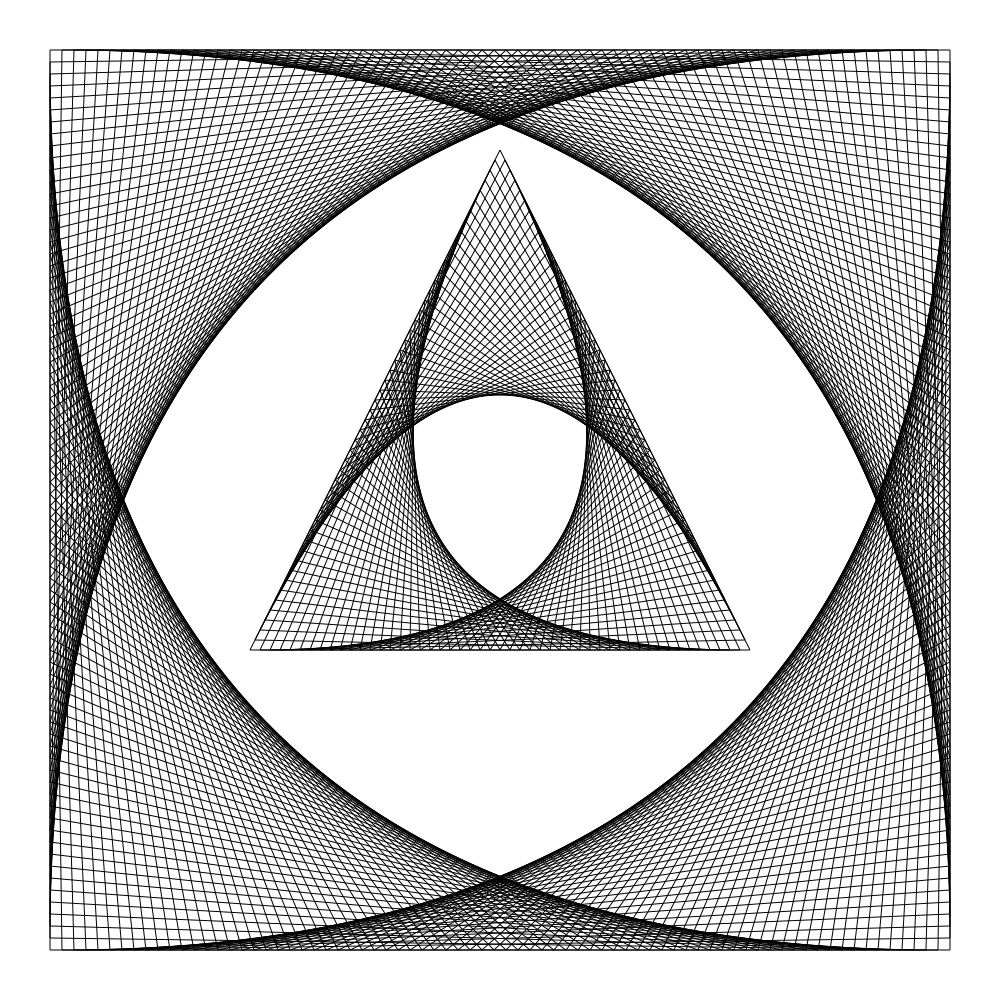
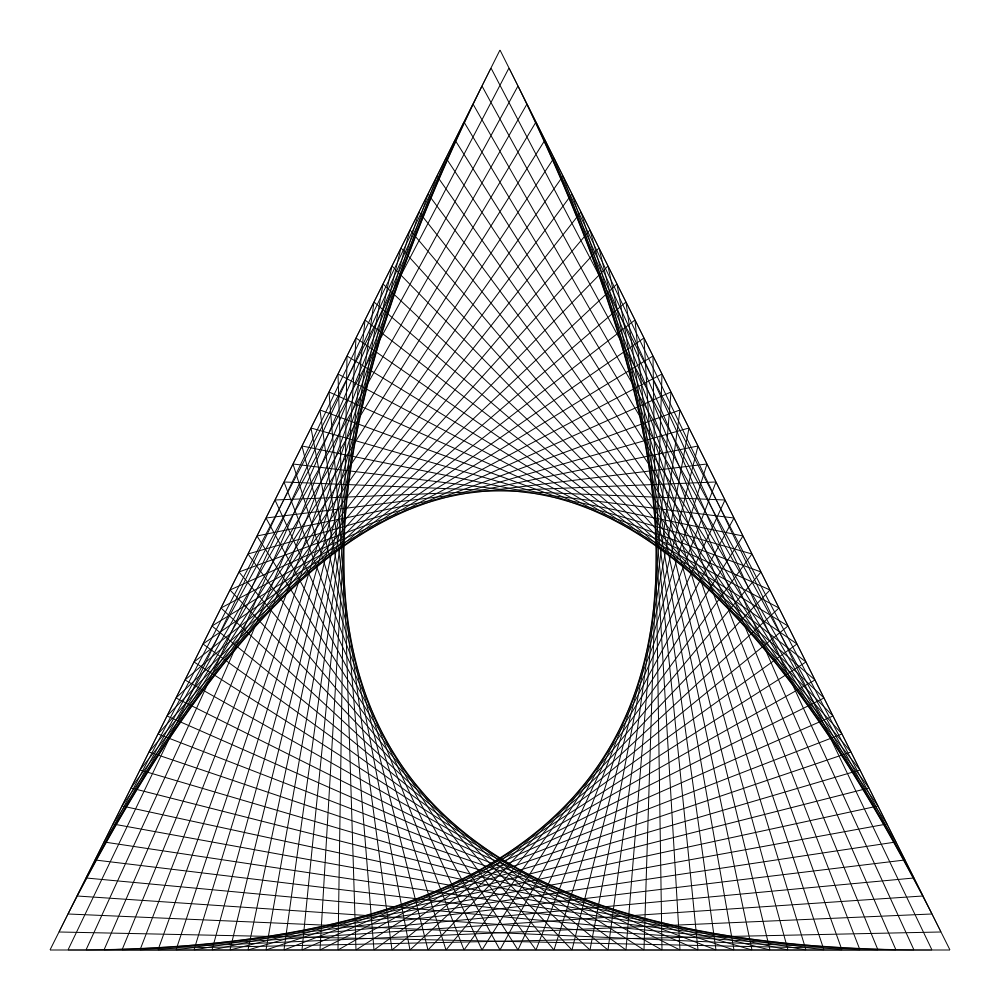
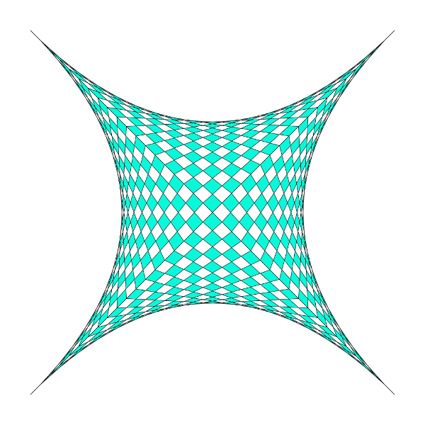
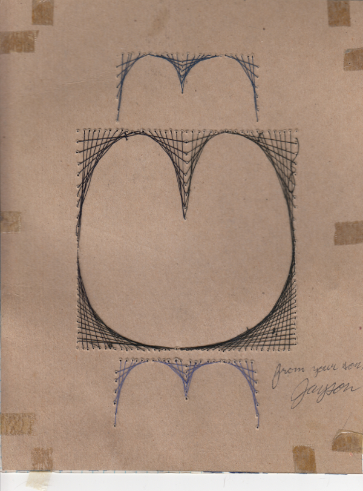
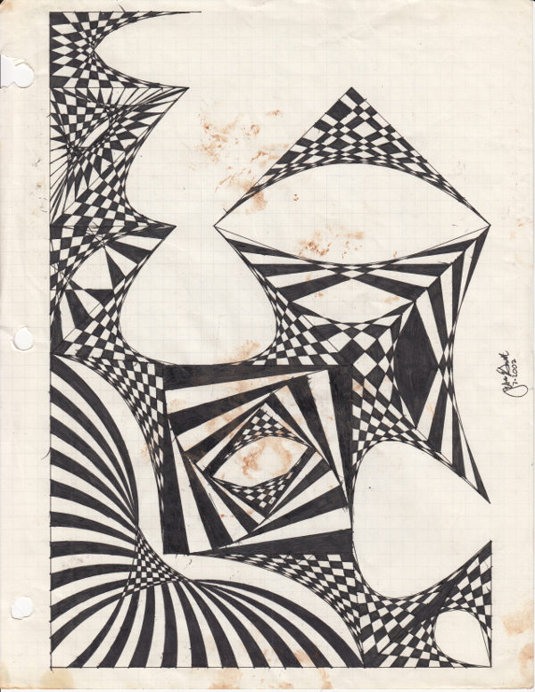
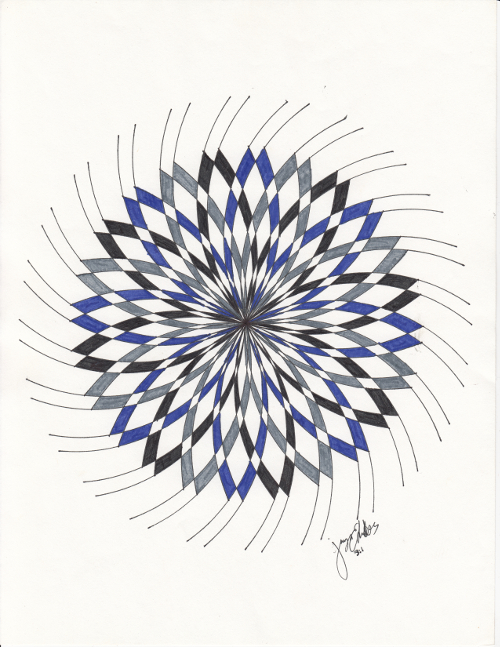

# `linedesigns`





The `linedesigns` project is the digitizing of an arts craft I was taught in my elementary school days. This code is meant to help out in prototyping new designs faster as doing actual designs by hand can take hours.

`linedesigns` exposes a few different methods for different shapes/designs:
- Line Dotted
- Rectangle
- Rectangle Dotted
- Triangle
- Triangle Dotted


## How To
```
$ go get -u github.com/jaysonesmith/linedesigns
```
```go
// new input: lineWidth, image width, image height
l := lines.New(0.1, 1000, 1000)
// input: x1, y1, x2, y2, x3, y3, line/dot frequency
// creation goes counterclockwise starting from the f irst point given
l.Triangle(0, .9, -.9, -.9, .9, -.9, 50)
// save
l.Save("triangle.png")
```

### Output:



With an image editor, you can also have some fun with color!



## Background

Line designs are essentially a series of points connected by straight or curved lines to create neat looking designs. To further add to these designs, the squares created by the crossing of lines can be filled in different patterns. (as shown above)

If I remember correctly, I was introduced to this type of art in 4th or 5th grade math class. Here's one of the earliest versions of one of these that I did as a kid:



That one had a piece of graph paper taped to the back side that was used as a guide for sewing the thread through on the other side.

The bulk of these types of works I've done have been with a rule/protractor, not the messy string as above. I did a lot of these later on in years and came up with a number of different ways they could be modified to be made more unique. Throughout my adult life I've sporadically done them and when doing one recently (April 2018) I thought about writing some software to help me out in prototyping.

Some of my older drawings:




## Thanks

Thanks to [@tidwall](http://twitter.com/tidwall) for his work on [pinhole](https://github.com/tidwall/pinhole) as linedesigns is built on top of it and this readme has be heavily influenced by [pinhole's](https://github.com/tidwall/pinhole)

## Contact

Jayson Smith [@thatengjayson](http://twitter.com/thatengjayson)

## License

`linedesigns` source code is available under the ISC [License](/LICENSE).