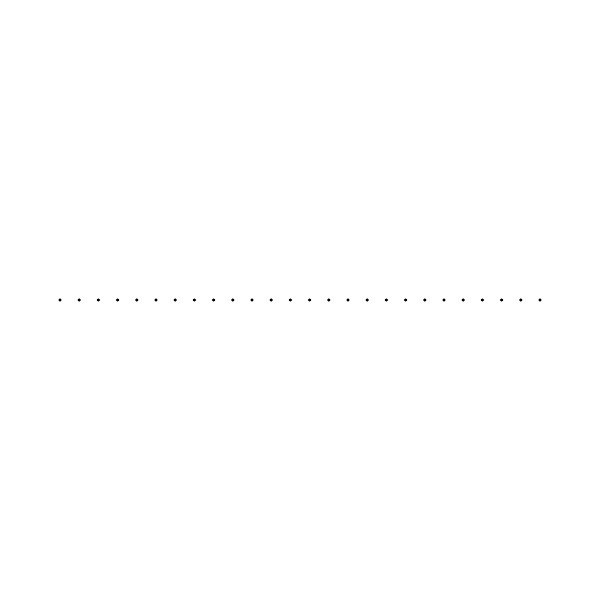
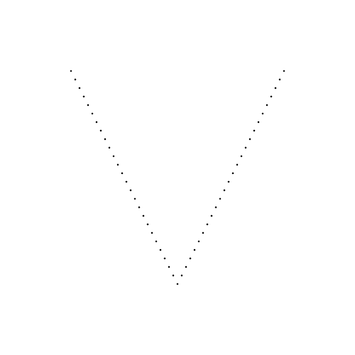
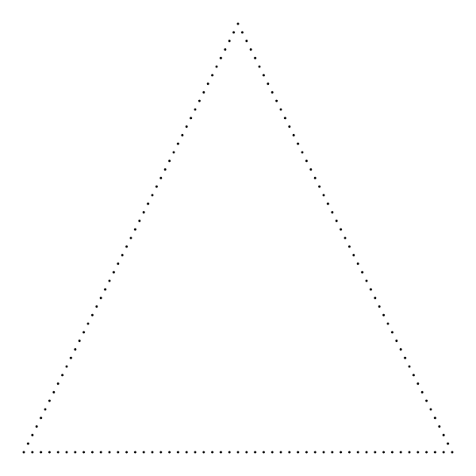
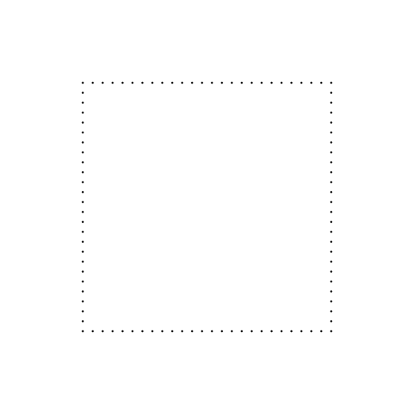
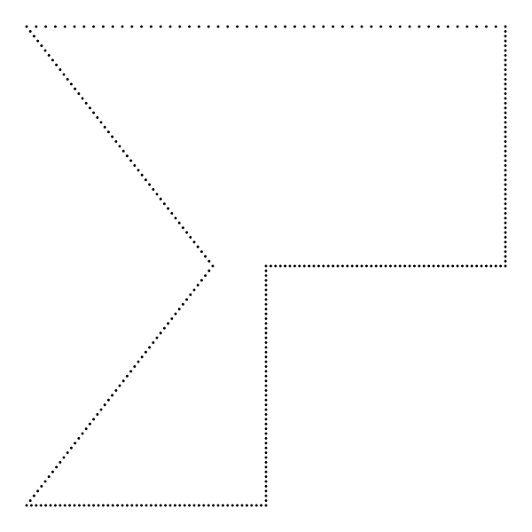

# `linedesigns`


`linedesigns` is the digitization of an arts craft I was taught in my elementary school days. It's meant to help prototype new designs quickly since doing these designs by hand can take hours.

---
## Install
```
$ go get -u github.com/jaysonesmith/linedesigns
```
---
## How To
`linedesigns` commands generally follow the pattern of taking in a series of coordinates that process/connect to one another in a counter-clockwise fashion.

Each run consists of three main steps: 
- **Object Creation** - setup a `linedesign` object to use by defining default line thickness, image width, and image height.
- **Design Creation** - These commands are what make the actual designs. You can perform as many design creation steps as you'd like in order to add multiple designs to a single image. Coordinate points are based off a Cartesian plane with (0,0) as the centered origin point and 1 being the max displayable point on either axis.
- **Saving** - Finalizes the current `linedesign` object and writes the file to disk.

### Start
The following examples will all assume that a `linedesigns` object has been created with the following:
```go
// new input: line width, dot size, image width, image height
l := lines.New(0.1, 0.05, 1000, 1000)
```


### Design Creators
`linedesign's` creators are split into two main groups based on their outputs:
- **Dotted** - Outputs only dots at each point position instead of connecting each by lines. This output can be used if you'd like to connect the lines yourself for instance. Takes in N number of coordinates to create designs from, a count of how many points per line segment/design to create, and a dot size.
- **Connected** - Outputs designs connected by lines. Currently the only method for line connection is via straight & black lines. These creators take in N amount of coordinates based on the shape to be created unless otherwise noted below.

#### Dotted Creators

**LineDotted**

The simplest command available to `linedesign`. It takes in two coordinates, a count, and outputs a single, dotted line.
```go
l.LineDotted(-.8, 0, .8, 0, 25)
```


**AngleDotted**

One step up from a single line. It takes in three coordinates, a count, and outputs a single, dotted angle.
```go
l.AngleDotted(-.6, .6, 0, -.6, .6, .6, 25)
```


**TriangleDotted**

TriangleDotted takes in three coordinates, a count, and outputs a dotted triangle.
```go
l.AngleDotted(-.6, .6, 0, -.6, .6, .6, 25)
```


**RectangleDotted**

RectangleDotted takes in four coordinates, a count, and outputs a dotted rectangle.
```go
l.RectangleDotted(-.6, .6, -.6, -.6, .6, -.6, .6, .6, 25)
```


**FreeformDotted**

FreeformDotted takes in a collection(slice of slices) of three or more coordinates, a count, and outputs a dotted whateveryoucreated. *Note: The two Freeform commands connect the last provided coordinate to the first.**
```go
coords := [][]float64{
    []float64{-.9, .9},
    []float64{-.2, .0},
    []float64{-.9, -.9},
    []float64{0, -.9},
    []float64{0, 0},
    []float64{.9, 0},
    []float64{.9, .9},
}
l.FreeformDotted(coords, 50)
```



---


With an image editor, you can also have some fun with color!


## Background

Line designs are essentially a series of points connected by straight or curved lines to create neat looking designs. To further add to these designs, the squares created by the crossing of lines can be filled in different patterns. (as shown above)

If I remember correctly, I was introduced to this type of art in 4th or 5th grade math class. Here's one of the earliest versions of one of these that I did as a kid:


That one had a piece of graph paper taped to the back side that was used as a guide for sewing the thread through on the other side.

The bulk of these types of works I've done have been with a rule/protractor, not the messy string as above. I did a lot of these later on in years and came up with a number of different ways they could be modified to be made more unique. Throughout my adult life I've sporadically done them and when doing one recently (April 2018) I thought about writing some software to help me out in prototyping.

Some of my older drawings:


## Thanks

Thanks to [@tidwall](http://twitter.com/tidwall) for his work on [pinhole](https://github.com/tidwall/pinhole) as linedesigns is built on top of it and this readme has been heavily influenced by [pinhole's](https://github.com/tidwall/pinhole)

## Contact

Jayson Smith [@thatengjayson](http://twitter.com/thatengjayson)

## License

`linedesigns` source code is available under the ISC [License](/LICENSE).